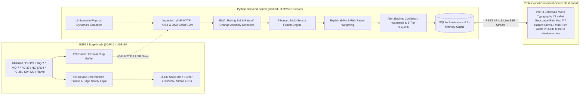

# Environmental Intelligence Network (EIN)

A low-cost, resilient, distributed edge AI environmental monitoring and multi-hazard early warning network for detecting **rising water & flash flooding, wildfires, hazardous air pollution, extreme heat conditions, landslide precursors, industrial emissions, and water quality degradation**.

---

## 1. System Architecture



---

## 2. Hardware Wiring (ESP32 30-Pin Dev Board)

| ESP32 Pin | Sensor / Module | Purpose | Notes |
|:---|:---|:---|:---|
| **GPIO21** | BME680 + OLED Display | `I2C SDA` | Shared I2C Data bus |
| **GPIO22** | BME680 + OLED Display | `I2C SCL` | Shared I2C Clock bus |
| **GPIO19** | DHT22 | `DATA` | Temp & Humidity backup |
| **GPIO34** | MQ-2 Gas Sensor | `AOUT` | Smoke & combustible gas (Input-only ADC1) |
| **GPIO35** | MQ-7 Gas Sensor | `AOUT` | Carbon Monoxide (CO) (Input-only ADC1) |
| **GPIO33** | FC-37 Rain Sensor | `AOUT` | Surface wetness / Rain intensity proxy |
| **GPIO32** | Water Level Sensor | `SIG` | Conductive water immersion sensor |
| **GPIO5** | HC-SR04 Ultrasonic | `TRIG` | Ultrasonic pulse trigger |
| **GPIO18** | HC-SR04 Ultrasonic | `ECHO` | Ultrasonic pulse echo input |
| **GPIO39** | FC-28 Soil Moisture | `AOUT` | Resistive soil probe (Input-only ADC1_CH3) |
| **GPIO23** | SW-420 Vibration | `DOUT` | Digital pulse interrupt counter |
| **GPIO25** | Flame Sensor | `DOUT` | Digital optical flame/IR detection |
| **GPIO26** | 2N2222A Transistor Base | `1kΩ Resistor` | Active Buzzer driver (Collector to Buzzer -, Emitter to GND) |
| **GPIO27** | Red LED | `Anode (220Ω)` | Critical Status Indicator |
| **GPIO14** | Yellow LED | `Anode (220Ω)` | Warning Status Indicator |
| **GPIO13** | Green LED | `Anode (220Ω)` | Normal Status & 1Hz Heartbeat Pulse |

*Power Supply: Standard 5V USB connection from host laptop (onboard ESP32 AMS1117 3.3V LDO regulator powers 3.3V sensors; 5V rail powers HC-SR04 / MQ heaters).*

---

## 3. The 7 Hazard Intelligence Categories

1. **Flood & Flash Floods**: Water depth, HC-SR04 sonic rise rate ($+6.8\text{ cm/min}$ flash surge), FC-37 rainfall intensity.
2. **Wildfire & Fire**: Optical IR flame detection, MQ-2 combustion smoke, thermal surges.
3. **Hazardous Air Pollution**: BME680 VOC gas resistance drops, persistent carbon monoxide plumes.
4. **Extreme Heat Conditions**: Ambient temperature levels $\ge 50^\circ\text{C}$, heat index humidity amplification.
5. **Landslide Precursors**: Saturated FC-28 soil moisture ($\ge 85\%$) correlated with SW-420 ground vibration tremor spikes.
6. **Industrial Chemical Emissions**: Focused chemical solvent vapors, industrial CO load, VOC resistance plummeting.
7. **Water Quality Degradation**: Acidic/alkaline pH divergence from 7.0, turbidity surges correlated with runoff.

---

## 4. Multi-Tier Community & Authority Notifications

- **🏘️ Citizen Advisory**: Community-wide mobile/web alerts during early warning stages.
- **🚔 Authority Dispatch**: Targeted dispatch to municipal emergency, fire, and police stations.
- **🆘 Disaster Emergency**: Immediate activation of regional disaster management response teams.

---

## 5. Quickstart: Running the System

### 1. Launch Backend Server & Live Dashboard
```bash
python backend/run_server.py
```
* Dashboard URL: `http://localhost:8000/`
* Default Login: **`admin`** / **`admin123`** (or `operator` / `operator123`)
* REST API: `http://localhost:8000/api/overview`
* Real-time SSE Stream: `http://localhost:8000/api/stream`

### 2. Run Automated Test Suite
```bash
python tests/run_tests.py
```

### 3. Flash ESP32 Firmware (PlatformIO)
```bash
cd firmware
pio run -t upload
pio device monitor -b 115200
```

---

## 6. Demonstration Scenarios (15 Physical Simulations)

Use the **Interactive Scenario Injector** in the bottom-right panel:
1. `NORMAL`: Baseline environmental conditions across all 4 zones.
2. `HEAVY_RAIN`: Rain sensor drops resistance, soil moisture and humidity increase.
3. `RAPID_WATER_RISE`: Flash flood surge ($+6.8\text{ cm/min}$), water level escalates rapidly.
4. `FLOOD`: Critical flood depth, triggers authentic **EAS Flood Siren**.
5. `SMOKE_EVENT`: Smoke detected on MQ-2 & MQ-7 without open flame.
6. `FIRE`: Open blaze, optical flame triggers, triggers **EAS Wildfire Siren**.
7. `POLLUTION_EVENT`: Severe VOC/CO plume, triggers **EAS Toxic Gas Siren**.
8. `EXTREME_HEAT`: Temperature surges to $54^\circ\text{C}$ with amplified heat index.
9. `LANDSLIDE_PRECURSOR`: Ground saturated ($92\%$) + SW-420 vibration spikes ($45\text{ hits/s}$).
10. `INDUSTRIAL_LEAK`: Chemical solvent plume with gas resistance $<15\text{ k}\Omega$.
11. `WATER_CONTAMINATION`: Toxic runoff, pH drops to 4.8, turbidity surges to $320\text{ NTU}$.
12. `MULTI_HAZARD`: Concurrent flood surge + industrial chemical leak.
13. `SENSOR_FAILURE`: Gracefully handled sensor fault without crashing.
14. `NODE_OFFLINE`: Node stops transmitting; transitions to `OFFLINE` status.
15. `WIFI_FAILURE`: Wi-Fi disconnect, node continues local monitoring & ring buffer caching.
