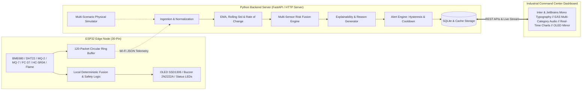

# Environmental Monitoring Command Center

A low-cost, resilient, AI-assisted environmental monitoring network for early detection, localized intelligence, and actionable alerts for **floods, forest fires, pollution events, and environmental hazards**.

---

## 1. System Architecture



---

## 2. Hardware Wiring (ESP32 30-Pin Dev Board)

| ESP32 Pin | Sensor / Module | Purpose | Notes |
|:---|:---|:---|:---|
| **GPIO21** | BME680 + OLED Display | `I2C SDA` | Shared I2C Data bus |
| **GPIO22** | BME680 + OLED Display | `I2C SCL` | Shared I2C Clock bus |
| **GPIO19** | DHT22 | `DATA` | Temp & Humidity backup |
| **GPIO34** | MQ-2 Gas Sensor | `AOUT` | Smoke & combustible gas (Input-only ADC1) |
| **GPIO35** | MQ-7 Gas Sensor | `AOUT` | Carbon Monoxide (CO) (Input-only ADC1) |
| **GPIO33** | FC-37 Rain Sensor | `AOUT` | Surface wetness / Rain proxy |
| **GPIO32** | Water Level Sensor | `SIG` | Conductive water immersion sensor |
| **GPIO5** | HC-SR04 Ultrasonic | `TRIG` | Ultrasonic pulse trigger |
| **GPIO18** | HC-SR04 Ultrasonic | `ECHO` | Ultrasonic pulse echo input |
| **GPIO25** | Flame Sensor | `DOUT` | Digital optical flame/IR detection |
| **GPIO26** | 2N2222A Transistor Base | `1kΩ Resistor` | Active Buzzer driver (Collector to Buzzer -, Emitter to GND) |
| **GPIO27** | Red LED | `Anode (220Ω)` | Critical Status Indicator |
| **GPIO14** | Yellow LED | `Anode (220Ω)` | Warning Status Indicator |
| **GPIO13** | Green LED | `Anode (220Ω)` | Normal Status & 1Hz Heartbeat Pulse |

---

## 3. Real EAS Sounds & Audio System

The system integrates real **Emergency Alert System (EAS)** sounds mapped by emergency category:

| Hazard Category | Sound File | Audio Characteristics |
|:---|:---|:---|
| **General Warning** | `dashboard/sounds/eas_warning.wav` | Authentic dual-tone **853 Hz + 960 Hz** Attention Signal pulse |
| **Flood Critical** | `dashboard/sounds/eas_flood.wav` | EAS Attention Tone + Rising/Falling Mechanical Air Raid Siren |
| **Wildfire Critical** | `dashboard/sounds/eas_fire.wav` | EAS Attention Tone + Rapid Thermal Siren Pulse |
| **Gas / Chemical Critical** | `dashboard/sounds/eas_gas.wav` | EAS Attention Tone + High-Frequency Hazmat Staccato Sweep |

### 🛠️ How to Customize the Sounds Yourself
You can easily swap any sound with your own audio files:
1. Place your `.wav` or `.mp3` files in the folder: `dashboard/sounds/`
2. Name them directly:
   * `eas_warning.wav` (for general warnings)
   * `eas_flood.wav` (for flood hazards)
   * `eas_fire.wav` (for wildfire hazards)
   * `eas_gas.wav` (for toxic gas/chemical hazards)
3. Or update the file paths in `dashboard/js/app.js` (lines 17–22):
   ```javascript
   this.soundPaths = {
     WARNING: "sounds/my_custom_warning.mp3",
     FLOOD: "sounds/my_flood_siren.mp3",
     FIRE: "sounds/my_fire_alarm.mp3",
     POLLUTION: "sounds/my_gas_alarm.mp3"
   };
   ```

---

## 4. Quickstart: Running the System

### 1. Launch Backend Server & Live Dashboard
```bash
python backend/run_server.py
```
* Dashboard URL: `http://localhost:8000/`
* Default Login: **`admin`** / **`admin123`** (or `operator` / `operator123`)
* REST API: `http://localhost:8000/api/overview`
* Real-time SSE Stream: `http://localhost:8000/api/stream`

### 2. Run Automated Test Suite
```bash
python tests/run_tests.py
```

### 3. Flash ESP32 Firmware (PlatformIO)
```bash
cd firmware
pio run -t upload
pio device monitor -b 115200
```

---

## 5. Step-by-Step Guide to Push this Project to Git

Follow these commands in PowerShell or Git Bash inside the project directory:

```bash
# Step 1: Initialize Git in the project root
git init

# Step 2: Check status to confirm files and .gitignore
git status

# Step 3: Stage all project files
git add .

# Step 4: Create your initial commit
git commit -m "feat: Resilient Environmental Monitoring Network initial release"

# Step 5: (If you created a new GitHub repo) Link your remote
git remote add origin https://github.com/<YOUR_USERNAME>/<YOUR_REPOSITORY_NAME>.git

# Step 6: Rename branch to main
git branch -M main

# Step 7: Push all code to your repository
git push -u origin main
```

---

## 6. Demonstration Scenarios

Use the **Interactive Scenario Injector** in the bottom-right panel to demonstrate:
1. `NORMAL`: Baseline environmental conditions.
2. `HEAVY_RAIN`: Rain sensor drops resistance, humidity rises.
3. `RAPID_WATER_RISE`: Flash flood surge ($+6.8\text{ cm/min}$), water level escalates rapidly.
4. `FLOOD`: Critical flood depth, plays authentic **EAS Flood Air Raid Siren**.
5. `SMOKE_EVENT`: Smoke detected on MQ-2 & MQ-7 without flame.
6. `FIRE`: Open blaze, optical flame triggers, plays authentic **EAS Wildfire Alarm**.
7. `POLLUTION_EVENT`: Severe VOC/CO plume, plays authentic **EAS Toxic Gas Alarm**.
8. `SENSOR_FAILURE`: Degraded sensor fault handled gracefully without crashing.
9. `NODE_OFFLINE`: Node stops transmitting; transitions to `OFFLINE` status.
10. `WIFI_FAILURE`: Wi-Fi disconnect, node continues local monitoring & ring buffer caching.
